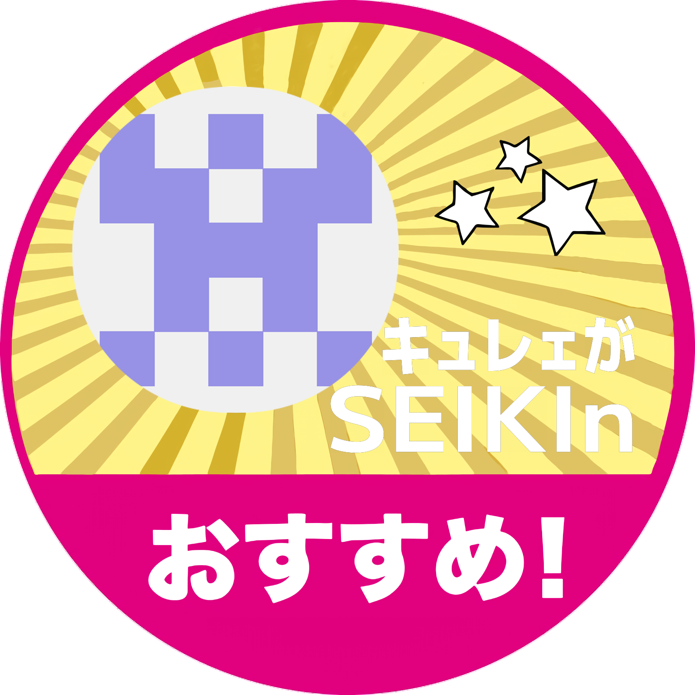

# seikinosusume

## なにこれ
セイキンおすすめシールっぽい画像を生成します

## sample

## Todo

- [x] 文字のでかさの調整

- [x] icon の描画ができるようにする

- [ ] wasm で利用可能にする
  - [x] wasm-bindgen で build 可能にする
  - [ ] うまいこと画像を受け取れるようにする

- [ ] FrontEnd をつくる

## License
フォントには [M+FONTS](https://mplusfonts.github.io) を使用しています。
