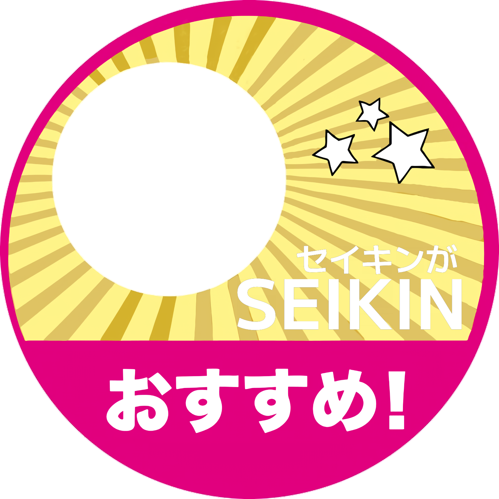

# seikinosusume

## なにこれ
セイキンおすすめシールっぽい画像を生成します

## sample

## Todo

- [ ] 文字のでかさの調整

- [ ] icon の描画ができるようにする

- [ ] wasm で利用可能にする

- [ ] FrontEnd をつくる

## License
フォントには [M+FONTS](https://mplusfonts.github.io) を使用しています。
